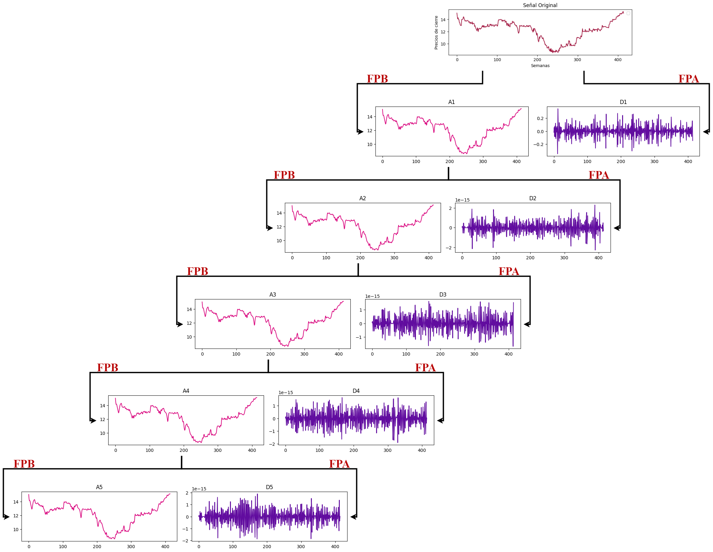
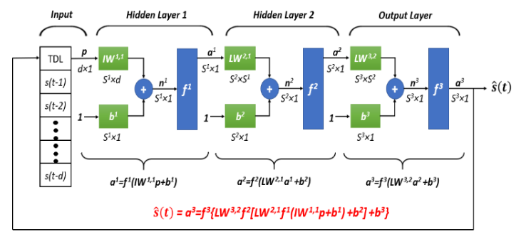
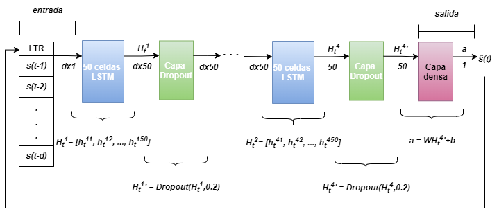

# Analysis of Neurnal Network Models in Stock Exchange Price Prediction

## Description
This project aims to find the best model to predict the stock prices in BMV (Bolsa Mexicana de Valores) along five years.

## Updates
- [15/08/2024] The very first version of the investigation has been uploaded to this public repo!

## Detailed Description
I focused in two kinds of models, with or without signal decomposition using the data wavelet transform. Also, the core NNs architectures used on it were:
| without DWT      |                              with DWT                          |                              Network                          |
| ------------- | -------------------------------------------------------| -------------------------------------------------------| 
| [NARNN](https://github.com/MiguelAngelLiera/NN-Stock-Exchange-Pc-/blob/main/NARNN.ipynb) | [DWT_NARNN](https://github.com/MiguelAngelLiera/NN-Stock-Exchange-Pc-/blob/main/DWT_NARNN.ipynb)     | Not Linear Auto-regressive NN (NARNN)                   |
| [LSTMNN](https://github.com/MiguelAngelLiera/NN-Stock-Exchange-Pc-/blob/main/NARNN.ipynb) | [DWT_LSTMNN](https://github.com/MiguelAngelLiera/NN-Stock-Exchange-Pc-/blob/main/DWT_NARNN.ipynb)     | Long Short-Term Memory NN (LSTMNN)   | 
| [GRUNN](https://github.com/MiguelAngelLiera/NN-Stock-Exchange-Pc-/blob/main/NARNN.ipynb) | [DWT_GRUNN](https://github.com/MiguelAngelLiera/NN-Stock-Exchange-Pc-/blob/main/DWT_NARNN.ipynb)       | Gated Recurrent Unit NN (GRUNN)     |

On these notebooks we can find the data-preprocesing, prediction and evaluation of the models.

## Data Wavelet Transform (DWT)

The DWT is the discretization of the Continous Wavelet Transform (CWT) that is an advanced technique in signal procesing that decompose data and functions in their frecuency coefficents. It depend on to variables, the frecuency and translation over time, doing a frecuencial and temporal analysis over the signal.

<!----->
<p align="center">
  
</p>
Five level decomposition of a time series (ACTINVRB)

## NARNN
They are an especific NN's architecture that consist in predicting future values starting with the past *d* values as an input.
<p align="center">
  
</p>

## LSTMNN
They are an especific NN's architecture that consist in predicting future values starting with the past *d* values as an input.
<p align="center">
  
</p>

## GRUNN
They are an especific NN's architecture that consist in predicting future values starting with the past *d* values as an input.
<p align="center">
  
</p>
<!--
# Efficiency

Comparison of method efficiency:

## Getting Started
### Environment Requirements

First, please make sure you have installed Conda. Then, our environment can be installed by:
```
conda create -n LTSF_Linear python=3.6.9
conda activate LTSF_Linear
pip install -r requirements.txt
```

### Data Preparation

You can obtain all the nine benchmarks from [Google Drive](https://drive.google.com/drive/folders/1ZOYpTUa82_jCcxIdTmyr0LXQfvaM9vIy) provided in Autoformer. All the datasets are well pre-processed and can be used easily.

```
mkdir dataset
```
**Please put them in the `./dataset` directory**

### Training Example
- In `scripts/ `, we provide the model implementation *Dlinear/Autoformer/Informer/Transformer*
- In `FEDformer/scripts/`, we provide the *FEDformer* implementation
- In `Pyraformer/scripts/`, we provide the *Pyraformer* implementation

For example:

To train the **LTSF-Linear** on **Exchange-Rate dataset**, you can use the script `scripts/EXP-LongForecasting/Linear/exchange_rate.sh`:
```
sh scripts/EXP-LongForecasting/Linear/exchange_rate.sh
```
It will start to train DLinear by default, the results will be shown in `logs/LongForecasting`. You can specify the name of the model in the script. (Linear, DLinear, NLinear)

All scripts about using LTSF-Linear on long forecasting task is in `scripts/EXP-LongForecasting/Linear/`, you can run them in a similar way. The default look-back window in scripts is 336, LTSF-Linear generally achieves better results with longer look-back window as dicussed in the paper. 

Scripts about look-back window size and long forecasting of FEDformer and Pyraformer are in `FEDformer/scripts` and `Pyraformer/scripts`, respectively. To run them, you need to first `cd FEDformer` or `cd Pyraformer`. Then, you can use sh to run them in a similar way. Logs will be stored in `logs/`.

Each experiment in `scripts/EXP-LongForecasting/Linear/` takes 5min-20min. For other Transformer scripts, since we put all related experiments in one script file, directly running them will take 8 hours per day. You can keep the experiments you are interested in and comment on the others. 

### Weights Visualization
As shown in our paper, the weights of LTSF-Linear can reveal some characteristics of the data, i.e., the periodicity. As an example, we provide the weight visualization of DLinear in `weight_plot.py`. To run the visualization, you need to input the model path (model_name) of DLinear (the model directory in `./checkpoint` by default). To obtain smooth and clear patterns, you can use the initialization we provided in the file of linear models.  


## Citing

If you find this repository useful for your work, please consider citing it as follows:

```BibTeX
@inproceedings{Zeng2022AreTE,
  title={Are Transformers Effective for Time Series Forecasting?},
  author={Ailing Zeng and Muxi Chen and Lei Zhang and Qiang Xu},
  journal={Proceedings of the AAAI Conference on Artificial Intelligence},
  year={2023}
}
```

Please remember to cite all the datasets and compared methods if you use them in your experiments.-->
